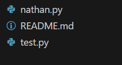

# Discuss similarities and differences in coding style

----

### Comments

**Example:**

|yours|LLM|

|||

**Discussion:**

```
Write your answer here.
```

----

### Function declarations

**Example:**

|yours|LLM|
|---|---|
|
|
|

**Discussion:**

```
Write your answer here.
```

----

### Organization of the JSON file

**Example:**

|yours|LLM|
|---|---|
|screenshot|screenshot|

**Discussion:**

```
Write your answer here.
```

----

### Print statements

**Example:**

|yours|LLM|
|---|---|
|screenshot|screenshot|

**Discussion:**

```
Write your answer here.
```

----

### Presenting the perplexity results

**Example:**

|yours|LLM|
|---|---|
|screenshot|screenshot|

**Discussion:**

```
Write your answer here.
```
